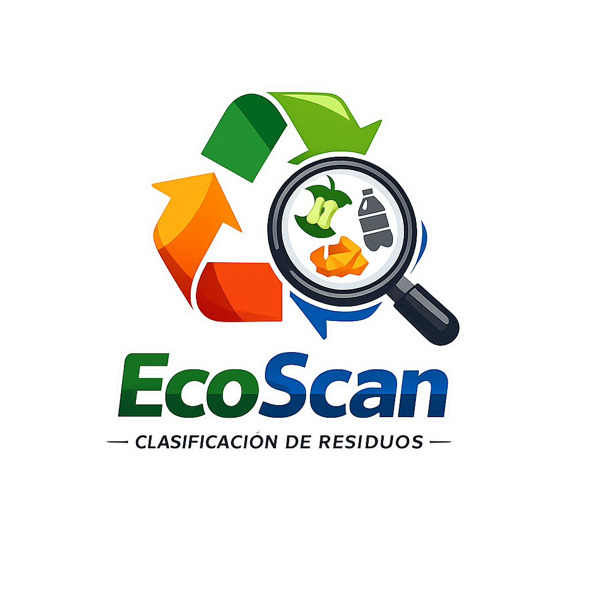

<div align="center">



# EcoScan — Clasificación Inteligente de Residuos

**Sistema de IA que clasifica imágenes de residuos en 9 categorías usando un ensemble de 4 redes neuronales convolucionales (CNN).**

[](https://python.org)
[](https://fastapi.tiangolo.com)
[](https://tensorflow.org)
[](https://docker.com)
[](LICENSE)

</div>

---

## 🌍 ¿De qué trata el proyecto?

**EcoScan** es un sistema de inteligencia artificial para la **clasificación automática de residuos** a partir de imágenes. El usuario sube una foto de un objeto o desecho, y el sistema lo analiza usando cuatro modelos de redes neuronales convolucionales entrenados para distinguir 9 tipos de materiales reciclables y no reciclables.

### 💡 ¿Por qué EcoScan?

Más del **90% de los residuos reciclables terminan en rellenos sanitarios** por clasificación incorrecta. EcoScan busca cambiar eso: con solo una foto, cualquier persona puede saber **qué tipo de residuo tiene y cómo reciclarlo correctamente**, fomentando una cultura ambiental responsable.

### 🎯 Objetivo del Proyecto

> Democratizar el acceso a herramientas de IA ambiental para facilitar el reciclaje correcto, reducir la contaminación y promover la economía circular.

---

## ✨ ¿Qué puede hacer EcoScan?

| Función | Descripción |
|---|---|
| 📸 **Clasificación por imagen** | Sube una foto y recibe la categoría del residuo al instante |
| 🤖 **Ensemble de 4 CNNs** | Combina 4 modelos para mayor precisión |
| ⚡ **Modo Cascade** | Clasifica más rápido en imágenes simples |
| 📊 **Probabilidades detalladas** | Muestra el porcentaje de confianza por categoría |
| 🌐 **Frontend incluido** | Interfaz web moderna lista para usar |
| 🐳 **Dockerizado** | Despliega en cualquier servidor en minutos |

---

## 🗂️ Categorías de Clasificación

| # | Categoría | Ícono | Ejemplos |
|---|-----------|-------|----------|
| 0 | Cardboard | 📦 | Cajas, cartón corrugado |
| 1 | E-Waste | 💻 | Teléfonos, cables, baterías |
| 2 | Glass | 🫙 | Botellas, frascos de vidrio |
| 3 | Metal | 🔩 | Latas, alambre, utensilios |
| 4 | Organic | 🥬 | Restos de comida, cáscaras |
| 5 | Paper | 📄 | Hojas, periódicos, revistas |
| 6 | Plastic | 🧴 | Botellas PET, empaques |
| 7 | Textile | 👕 | Ropa, telas, hilos |
| 8 | Trash | 🗑️ | Residuos mixtos no reciclables |

---

## 🏗️ Arquitectura del Sistema

```
waste-classifier-app/
├── 🖥️  backend/
│   ├── app/
│   │   ├── main.py            # FastAPI — endpoints y servidor estático
│   │   ├── inference.py       # Carga de modelos + ensemble/cascade
│   │   ├── schemas.py         # Modelos Pydantic (request/response)
│   │   └── models/            # ← Coloca aquí los archivos *_inference.keras
│   ├── requirements.txt
│   └── Dockerfile
├── 🎨  frontend/
│   ├── index.html             # Interfaz principal
│   ├── styles.css             # Estilos modernos
│   ├── app.js                 # Lógica del cliente
│   └── logo.png               # Logo del sistema
├── prepare_models.py          # Script para preparar modelos
└── 📄 README.md
```

**Una sola instancia de FastAPI sirve tanto la API como el frontend.**

---

## 🚀 Instalación y Uso

### Requisitos Previos

- Python **3.10 o superior**
- pip
- (Opcional) Docker

### Paso 1 — Clonar el repositorio

```bash
git clone https://github.com/Jostinchalan/EcoScam---Clasificacion-de-Residuos.git
cd EcoScam---Clasificacion-de-Residuos
```

### Paso 2 — Preparar los modelos *(solo la primera vez)*

Coloca tus 4 archivos `.keras` originales en la raíz del proyecto, luego ejecuta:

```bash
pip install tensorflow
python prepare_models.py
```

> ✅ Esto genera los 4 archivos `*_inference.keras` en `backend/app/models/`.  
> Verifica que cada modelo imprima `output_shape=(None, 9)`.

### Paso 3 — Instalar dependencias

```bash
cd backend
pip install -r requirements.txt
```

### Paso 4 — Ejecutar el servidor

```bash
# Desde la raíz del proyecto:
uvicorn backend.app.main:app --reload --port 8000
```

O desde la carpeta `backend/`:

```bash
cd backend
uvicorn app.main:app --reload --port 8000
```

### Paso 5 — Abrir en el navegador

```
http://localhost:8000
```

📚 Documentación interactiva de la API:

```
http://localhost:8000/docs
```

---

## 🐳 Despliegue con Docker

### Construir la imagen

```bash
# Desde la raíz del proyecto:
docker build -f backend/Dockerfile -t ecoscan .
```

### Ejecutar el contenedor

```bash
docker run -p 8000:8000 ecoscan
```

Visita `http://localhost:8000` 🎉

---

## 📡 API Reference

### `POST /predict` — Clasificar una imagen

**Request:** `multipart/form-data`

| Campo | Tipo | Requerido | Descripción |
|-------|------|-----------|-------------|
| `file` | imagen | ✅ | JPEG, PNG, WebP... |
| `mode` | `ensemble` \| `cascade` | ❌ | Por defecto: `ensemble` |
| `cascade_threshold` | float 0–1 | ❌ | Por defecto: `0.70` (solo cascade) |

**Response ejemplo:**

```json
{
  "final_label": "plastic",
  "final_confidence": 0.923,
  "mode": "ensemble",
  "per_model": [
    {
      "model_id": "cnn1",
      "model_name": "Custom CNN",
      "label": "plastic",
      "confidence": 0.91,
      "probabilities": [0.00, 0.00, 0.01, 0.00, 0.01, 0.01, 0.91, 0.05, 0.01]
    }
  ],
  "class_labels": ["cardboard", "e-waste", "glass", "metal", "organic", "paper", "plastic", "textile", "trash"]
}
```

### `GET /health` — Estado del sistema

Retorna los modelos cargados y las etiquetas de clase disponibles.

---

## 🧠 Modos de Predicción

| Modo | Estrategia | Cuándo usarlo |
|------|-----------|---------------|
| **Ensemble** *(defecto)* | Promedio de softmax de los 4 modelos | Máxima precisión |
| **Cascade** | CNN1 → CNN2 → CNN3 → CNN4, se detiene si confianza ≥ umbral | Imágenes simples, más rápido |

---

## ☁️ Despliegue en la Nube

### Render / Railway

1. Sube el repositorio a GitHub.
2. Crea un nuevo *Web Service* apuntando al repo.
3. Define **Dockerfile path**: `backend/Dockerfile`.
4. Define **Port**: `8000`.

### Fly.io

```bash
fly launch --dockerfile backend/Dockerfile --name ecoscan
fly deploy
```

### Hugging Face Spaces

Crea un Space con SDK **Docker**, sube el repositorio y establece `PORT=7860` en el `EXPOSE` del Dockerfile.

---

## 🗺️ Roadmap — Próximas Funcionalidades

- [ ] 🔥 **Grad-CAM** — Visualización de zonas de atención en la imagen
- [ ] 📍 **Geolocalización** — Punto de reciclaje más cercano
- [ ] 📈 **Dashboard de impacto** — Estimación de CO₂ ahorrado por categoría
- [ ] 📱 **PWA offline** — Funciona sin internet con modelo TFLite
- [ ] 🎙️ **Web Speech API** — Resultado por voz
- [ ] 🔁 **Botón de corrección** — Retroalimentación para reentrenamiento

---

## 🤝 Contribuciones

¡Las contribuciones son bienvenidas! Si tienes ideas, mejoras o encuentras algún bug:

1. Haz un **fork** del repositorio
2. Crea una rama: `git checkout -b feature/mi-mejora`
3. Haz commit: `git commit -m "Agrego mi mejora"`
4. Push: `git push origin feature/mi-mejora`
5. Abre un **Pull Request**

---

## 📜 Licencia

Este proyecto está bajo la licencia **MIT**. Puedes usarlo libremente para proyectos personales, académicos o comerciales.

---

<div align="center">

**Hecho con 💚 para un planeta más limpio**

*EcoScan — Clasificación de Residuos con Inteligencia Artificial*

</div>

---

## Categories

| Index | Label | Icon |
|-------|-------|------|
| 0 | cardboard | 📦 |
| 1 | e-waste | 💻 |
| 2 | glass | 🫙 |
| 3 | metal | 🔩 |
| 4 | organic | 🥬 |
| 5 | paper | 📄 |
| 6 | plastic | 🧴 |
| 7 | textile | 👕 |
| 8 | trash | 🗑️ |

---

## Project Structure

```
waste-classifier-app/
├── backend/
│   ├── app/
│   │   ├── main.py            # FastAPI app + endpoints
│   │   ├── inference.py       # Model loading + ensemble/cascade
│   │   ├── schemas.py         # Pydantic request/response models
│   │   └── models/            # ← Place *_inference.keras here
│   │       └── README.md
│   ├── requirements.txt
│   └── Dockerfile
├── frontend/
│   ├── index.html
│   ├── styles.css
│   └── app.js
├── prepare_models.py          # Optimizer-stripping utility
└── README.md
```

---

## Quick Start

### Step 0 — Prepare models (one-time)

Place your 4 original `.keras` files in the project root, then run:

```bash
pip install tensorflow
python prepare_models.py
```

This generates the 4 `*_inference.keras` files in `backend/app/models/`.

> **Verify the output:** each model must print `output_shape=(None, 9)`.

### Step 1 — Install dependencies

```bash
cd backend
pip install -r requirements.txt
```

### Step 2 — Run locally

```bash
# From the project root:
uvicorn backend.app.main:app --reload --port 8000
```

Or from within `backend/`:

```bash
cd backend
uvicorn app.main:app --reload --port 8000
```

Open **http://localhost:8000** in your browser.  
API docs: **http://localhost:8000/docs**

---

## Docker

### Build

```bash
# From the project root (where Dockerfile lives):
docker build -f backend/Dockerfile -t ecoscan .
```

### Run

```bash
docker run -p 8000:8000 ecoscan
```

---

## API Reference

### `POST /predict`

Classify a waste image.

**Request:** `multipart/form-data`

| Field | Type | Required | Description |
|-------|------|----------|-------------|
| `file` | image | ✅ | JPEG, PNG, WebP, … |
| `mode` | `ensemble` \| `cascade` | ✗ | Default: `ensemble` |
| `cascade_threshold` | float 0–1 | ✗ | Default: `0.70` (cascade only) |

**Response:** `application/json`

```json
{
  "final_label": "plastic",
  "final_confidence": 0.923,
  "mode": "ensemble",
  "per_model": [
    {
      "model_id": "cnn1",
      "model_name": "Custom CNN",
      "label": "plastic",
      "confidence": 0.91,
      "probabilities": [0.00, 0.00, 0.01, 0.00, 0.01, 0.01, 0.91, 0.05, 0.01]
    }
    // ... 3 more
  ],
  "class_labels": ["cardboard", "e-waste", "glass", "metal", "organic", "paper", "plastic", "textile", "trash"]
}
```

### `GET /health`

Returns loaded model IDs and class labels.

---

## Prediction Modes

| Mode | Strategy | When to use |
|------|----------|-------------|
| **Ensemble** (default) | Average softmax of all 4 models | Best accuracy |
| **Cascade** | CNN1 → CNN2 → CNN3 → CNN4, stops when confidence ≥ threshold | Faster on easy images |

---

## Deployment

### Render / Railway

1. Push the repo to GitHub.
2. Create a new Web Service pointing to the repo.
3. Set **Dockerfile path**: `backend/Dockerfile`.
4. Set **Port**: `8000`.

### Fly.io

```bash
fly launch --dockerfile backend/Dockerfile --name ecoscan
fly deploy
```

### Hugging Face Spaces

Create a Space with **Docker** SDK, upload the repo, set `PORT=7860` in the Dockerfile `EXPOSE` line.

---

## Class Label Verification

If you have a `class_indices.json` from training, compare it to the array in `backend/app/schemas.py`:

```python
CLASS_LABELS = [
    "cardboard",  # 0
    "e-waste",    # 1
    "glass",      # 2
    "metal",      # 3
    "organic",    # 4
    "paper",      # 5
    "plastic",    # 6
    "textile",    # 7
    "trash",      # 8
]
```

If the order differs, update this list (and the copy in `inference.py`) before running inference.

---

## Phase 2 Roadmap

- [ ] Grad-CAM heatmap overlay
- [ ] Nearest recycling point geolocation
- [ ] Impact dashboard (CO2 estimate per category)
- [ ] PWA with offline CNN1/TFLite
- [ ] Web Speech API voice output
- [ ] User correction button for retraining
